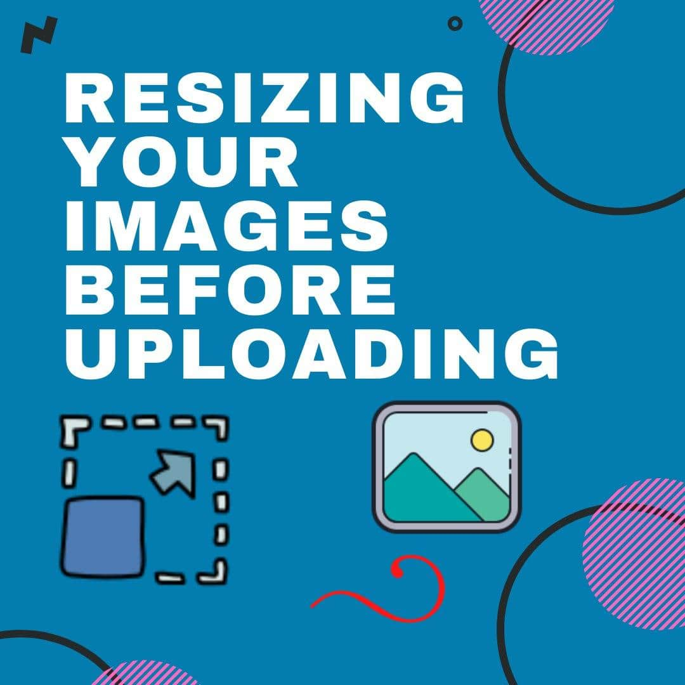

# why you should resize your images before uploading it to server?

if you are making an app that users are submiting their own images and you are saving them to your server or database then you must resize your images based on the app that you have. imagine you want to display an image in your app with 200px _ 200px but the user submited a very large image. something like 1080px _ 1080px. at this point you have two options. you can save the massive image and change the size with css or alternatively you can resize the image before user submission. but there is a problem with the first approach. if you want to display a small image I don't see any point in saving a massive image, it is pointless. and it is just a waste of space in your server or database. also it will cause huge performance issues :sweat: because each time server is sending a massive image that is not going to be used. so now hope you know why it is important to resize user submited images :blush:

## how you can resize your images?

there are two approaches that you can resize your images. 1:client-side 2:server-side.
which method is better?:confused: it depends on how you want to save your images if you want to save them in server then server-side approach is better but of you want to save them in database(binary format) then client-side approach is the best. in this blog I'm going to show you how you can resize you images in client-side and save them in binary format in database. if you want a blog that shows you how you can save images in server please let me know in the comment section.

## setup the project

all you need for this project is a javascript and an html file.thats it.open your favorite text editor and create these files and jump to the next section.

## html setup

```html
<html>
	<head>
		<link rel="stylesheet" href="index.css" />
	</head>
	<body>
		<form>
			<input type="file" id="input" />
		</form>
		<script src="index.pack.js"></script>
	</body>
</html>
```

from the input we are going to grab the image and then we are going to do all the magic :dizzy_face:

## javascript part

when user selected a file for that input. change event will be fired and because we want to do all our stuff after recieving the image so we should wrap our code inside that event listener.

```js
let input = document.querySelector('#input');
input.addEventListener('change', () => {
	//this function will run when user selects an image
});
```

when user selected that image we are going to instantiate our fileReader. fileReader object in javascript allows us to read the content of file asynchronously. beacause it is async we have some event for it. these events allows us to know we are in which state currently. we are going to use <span class='highlight'>onload</span> event. this event will occur when fileReader object reads the file succesfully.but before reading it we should tell to fileReader that which file it is going to read

```js
let input = document.querySelector('#input');
input.addEventListener('change', () => {
	let fileReader = new FileReader();
	let uploadedImage = document.querySelector('#input').files[0];
	fileReader.readAsDataURL(uploadedImage);
	fileReader.onload = (e) => {
		// e.target.result is the uploaded image in base64 format
		console.log(e.target.result);
	};
});
```

in a real world application you really don't want to show both images(original and resized) for user both for demonstrate what is happening under the hood I'm going to show you what both images. for that you have to add two img tag to your html

```html
<html>
	<head>
		<link rel="stylesheet" href="index.css" />
	</head>
	<body>
		<form>
			<input type="file" id="input" />
		</form>
		
		
		<script src="index.pack.js"></script>
	</body>
</html>
```

then we are going to display the original image.

```js
fileReader.onload = (e) => {
	//console.log(e.target.result)
	let original_img = document.querySelector('#original-img');
	original_img.src = e.target.result;
};
```

now we are going to do the most important thing. we are going to create a canvas element and resize our image. html5 canvas element is a normal html tag that allows us to create 2D elements in browser. if you want to know more about canvas checkout <span class='highlight'>chriscourses</span> youtube channel

```js
let input = document.querySelector('#input');
input.addEventListener('change', () => {
	let fileReader = new FileReader();
	let uploadFile = input.files[0];
	fileReader.readAsDataURL(uploadFile);
	fileReader.onload = (e) => {
		//parameter that we are recieving here (e) is the file itself
		let image = new Image();
		//if we try to change the src of the image without waiting for load event
		//we will get an error becuase loading an image is async
		image.onload = (img) => {
			//the img parameter is the original image(non-resized)
			document.querySelector('#original-img').src = image.src;
			var canvas = document.createElement('canvas');
			var context = canvas.getContext('2d');
			//MAX_WIDTH variable is doing all the magic you can set it to your fav size
			const MAX_WIDTH = 200;
			const scaleSize = MAX_WIDTH / img.target.width;
			canvas.width = MAX_WIDTH;
			//we are changing the height of the image based on howmuch the width is changed
			canvas.height = img.target.height * scaleSize;
			//if you want to know more about drawImage method check this link:
			//https://www.w3schools.com/tags/canvas_drawimage.asp
			context.drawImage(image, 0, 0, image.width, image.height, 0, 0, canvas.width, canvas.height);
			document.querySelector('#resized-img').src = canvas.toDataURL('image/jpeg', 0.9);
		};
		image.src = e.target.result;
	};
});
```

:::tip

canvas.toDataURL() method takes two argument the first one is the type of the image that we want in result. second argument is optional it defines the quality of image. the default value is 0.92
but you can give any number from 0 to 1.

:::
canvas.toDataURL() method returns a very long string similar to this
<span class='highlight'>'data:image/jpeg;base64,/9j
/4AAQSkZgABAQEBLAE...'</span>
. you can store that string in database.

yeah. that was all about resizing image with vanilla javascript. hope you learned something please let me know in the comments if it worked for you.
thank you so much for reading, have a great day. :blush::blush:
<br/>
<br/>
<br/>
<disqus/>
