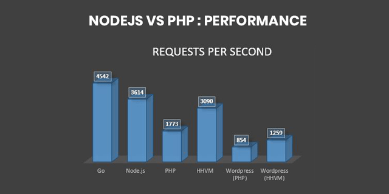

# php vs node.js
php and node are the two boss in their fields. they both provide great solutions for the complicated back-end world but also they have their own weaknesses :weary:.  if you are wondering which technology is better for my app read till the end. we are going to compare these two technologies in different categories also i will give you my personal advices. at the end you will have a clear idea about differences between these two languages ok let's start :wink:.
## 1-ecosystem
ecosystem in every language is a big deal specially if you are a beginner and if you will face with many problems. i remember when i was a beginner i was so curious about which one should i choose to start my full-stack development journey and nearly 90% of the people that i asked or the resources that I've found was saying that if you are familiar with javascript then you must choose node and I've seen a lot of people those days that they are moving from php and saying that php is dead and it is a mistake to learn it :hushed: I said okay and i started to work with node and I've build a lot of projects such as login system,insta clone,youtube clone,etc. i was very comfortable with node i was thinking that it is the best thing. after a while just because of curiosity i started to play around with php and I've noticed that the amount of resources for php is at least 10x times more than node. and i remebered how much i struggled to find something in node when it is in every where for php. also according to stackoveflow there is 1.3 million questions for php and it is 350k for node so if you are struggling to find the solution of your problem in both It is more possible to find it for php. and it is the same for youtube videos,blogs,etc.

<strong>Winner:</strong>PHP

## 2-learning curve
it depends on your background if you are a javascript developer it is reasonable to start with nodejs but take it consider that with just nodejs you can't build any server(it will be very hard) because of that you have to learn express which is a framework for node also php has it's frameworks but they are sort of optional. definitely framework will make your life easier but in php it is not neccessary to use a framework but in node it is. in general php is a very easy language but I'm supposing that you have are coming form a javascript background.

<strong>Winner:</strong>NODE

## 3-performance
this also depends on type of your app if you are making a real-time app like chat or online-gaming app definitely you should go with node 
  
node is the best choice when it comes to speed. but if your app dynamic like some sort of e-commerce or dashboard then php is for you. also there is another thing in node which is it's asynchronous or non-blocking nature this means in node when you are making a call instead of waiting for it to finish you can do other things while it is happening but in synchronous code like php when you are making a call you have to wail till it finishes and this feature in node makes it incredibily fast in compare to node.

<strong>Winner:</strong>NODE

## 4-job market
according to indeed.com there are nearly 7000 jobs for php developers and for node.js it is 5000. as a freelance developer I can say that the job market for php is by far better than nodejs the main reason for that is content managment systems like wordpress and joomla. techjury.net over 30% of all websites over the world are built in wordpress :grimacing:. so yeah there is no doubt that in 2021 the job market for php is better.

<strong>Winner:</strong>PHP

## 5-database
you can use any sort of database(relational and noSQL) with both php and node but I can say that 99% of php developers are using some sort of relational database like mysql or postgresql and also 90% of node.js developers using noSQL databases like mongodb becuase it makes sense to use noSQL with javascript becuase it stores data in json format. but according to 2020 stackoverflow survey the  most three popular database are like this:1-mysql 2-postgresql 3-microsoft sql server. the most popular noSQL database is mongodb which is in 5th order in this list.
<strong>Winner:</strong>PHP

## 6-third party packages
in node.js it is nearly impossible to build an app without using npm packages even for very simple tasks like hashing a password or validate an email you have to install third party packages but in php these kind of stuff are built in php so you don't have to install anything to hash a password or connect to a database. becuse php is specifically for back-end and it is very mature in compare to node.

<strong>Winner:</strong>PHP

## my thoughts
I am hearing that php is dead since my first day of learning web development. but be sure that php is not dead it is very relevant very easy to use and also very easy to use integrate in html you can write your normal html and beside it you can write your php in script tag. also it is used by so many big companies like yahoo and facebook. node is also very relevent it used by companied like netflix and nasa,uber it is not as easy as php to integrate with your html but also it is not too complicated. even after reading this blog if you don't know what to learn i suggest that just watch a project-based video on youtube for both of them. then think about which one is the best for you.
hope you learned something about both of these technologies please share your comments with me in the section below :smiley:.
 
 
 
 
 
 
<disqus/>