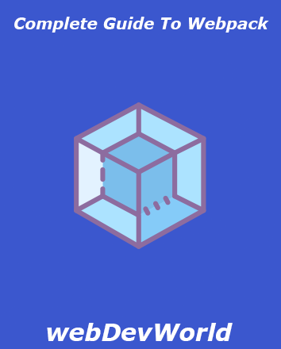
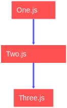

# webpack tutorial



## what is webpack?

one of the most important tools in web development is definitely webpack when I was a beginner
I was supposing that it is useless and i can do the same thing without webpack but when I started
to dealing with larger projects I found out that it is life saver. especially when you are dealing
with many js-css-sass,... files. if you search in google what is webpack you will see this definition : webpack is a module bundler.that is true but not the best definition for a beginner
let's break it down. imagine we have a project and it has three js files.


and each file depends on other file. that's mean we need one.js to execute two.js and also
two.js to execute three.js. therefore we are requiring one.js from two.js and two.js from
three.js (with <span class='highlight'>import</span> or <span class='highlight'>require</span> statements).
in order to execute all of the files properly we should include script tags in order in html page
which is very ease in this case but imagine we have a larger project with 30 js files it can be very
difficult to include all of them in order. this is where webpack start it's magic. i takes all js files and it will include them properly in html. so we don't need to worry about order. this is not
the only benefit of using webpack you will learn more as we go along. if you are using js frameworks
like <span class='highlight'>vue</span> or <span class='highlight'>react</span> (with cli) you don't
have to use webpack manually because cli is using webpack out of the box. when you are running this
command:

```sh
npm run build
```

webpack is taking all of your files such as js,sass,less,ts,...
and and budling them together. we are not going to use any framework for this tutorial. we are going
to use plain js with css and sass.Ok let's start :tada::tada:

:::tip
before we start the practical part there is a few concepts
that you should understand:1-entry 2-output 3-loaders 4-mode
:::

<span class='highlight'><strong>Entry:</strong></span>
entry point in webpack is the file that webpack starts from it to build it's dependency graph we can specify the location of entry point but by default the entry point is ./src/index.js . it will start from index.js and depends on modules that we've used in it webpack will create the dependency graph.
<br/>
<span class='highlight'><strong>Output:</strong></span>
output is the location that all of bundles will go there. by default the output location is ./dist/main.js . but you don't have to make dist folder manually. webpack will do that for you.
<br/>
<span class='highlight'><strong>Loaders:</strong></span>
by default webpack can just understand files with .js and .json extension. so all other files such as css,typescript,sass will be converted to javascript and this process is done with help of loaders.
<br/>
<span class='highlight'><strong>Mode:</strong></span>
it specify that we are using webpack in development mode or production mode.
we should use production mode when our app is ready to deploy.

## install webpack

first we should make a folder(my-webapck) for our project then create a package.json file with this command and then change the directiory to my-webpack folder:

```sh
mkdir my-webpack && npm init -y && cd <nameOfProject>
```

then we should install webpack locally in our devDependencies because we don't need webpack when we are deploying our app

```sh
npm i webpack webpack-cli --save-dev
```

in package.json file add these lines to your scripts:

```json
"dev": "webpack --mode development",
"build": "webpack --mode production"
```

`npm run dev` command will run webpack in development mode and
`npm run build` will run webpack in production mode.

now create a src folder at the root of your project and create an index.js file in it
.inside of index.js just include this:

```js
console.log("hello world");
```

then run `npm run dev` command you will see a dist folder will show and main.js file in it open up main.js you will see the `console.log('hello world')` at the end
but wait!!!! :confused::confused: we just wrote a single line of code but there is nearly 100 lines now. yes the extra 99 lines of code is the code that webpack will do all of it's magic work with so don't worry and don't delete them. so the code in index.js is bundled by webpack but to make sure that our code is working properly in browser we have to make an index.html page let's make it in dist folder that webpack created for us.

```html
<!DOCTYPE html>
<html lang="en">
  <head>
    <meta charset="UTF-8" />
  </head>
  <body>
    <script src="main.js"></script>
  </body>
</html>
```

## html-webpack-plugin

yeah it's working you can see 'hello world' in the console of browser.
so far,so good but there is a little problem. imagine we want to change the name of index.js file in src folder . then we have to run `npm run dev` command again
to rebuild the dist folder. name of the js file in dist folder gonna change but in index.html we are referencing main.js which does'nt exist. in conclusion it is not good to write index.html manually we can solve this problem by installing this package

```sh
npm i html-webpack-plugin --save-dev
```

to activate this plugin and other configurations we have to make `webpack.config.js` file at the root directory with this content:

```js
const htmlWebpackPlugin = require("html-webpack-plugin");
const path = require("path");

module.exports = {
  plugins: [
    new htmlWebpackPlugin({
      title: "hey I'm title",
    }),
  ],
};
```

run `npm run dev` command and you will see that an index.html page is generated with that specific title and script tag included automatically.

I mentioned earlier that there is default locations for entry point and output but we can change them in `webpack.config.js`.add this part before plugins.

```js
entry:'./src/app.js',
output:{
    filename:'[name].bundle.js',
    path:path.resolve(__dirname,'dist')
}
```

now rename the index.js file to app.js and create `app2.js` in src folder with this content:

```js
export default (text = "good morning guys") => {
  const element = document.createElement("p");

  element.innerHTML = text;

  return element;
};
```

in app.js:

```js
import app2 from "./app2";
document.body.appendChild(app2());
```

and run `npm run dev`.

## babel-loader

now you can see index.html and main.bundle.js in your dist folder if you open that up and scroll all the way to bottom you can see there is an arrow function which is an ES6 feature and some older browsers don't support `ES6` so we need to compile it to normal function and make it compatible with all browsers. here we have to use babel which is a loader and also extra packages which babel depends on them

```sh
npm i babel-loader @babel/core @babel/preset-env --save-dev
```

for activate this loader lets go to `webpack.config.js`.
to activating a loader we should make rules array before plugins and after output.
:::tip
each object in rules array represent a single loader and these objects have three properties: `test:`the value of test is REGEX that specifies which files we want to to be processed by a specific loader.
`exclude:` it defines the type of file that we don't want to be processed by a loader.
`use:` it defines which loader will be used against matched modules
:::
add these lines to your `webpack.config.js` before plugins:

```js
 module: {
        rules: [
            {
                test: /\.js$/,
                exclude: /node_modules/,
                use: {
                    loader: 'babel-loader',
                    options: {
                        presets: ['@babel/preset-env']
                    }
                }
            }
        ]
    },
```

and now run `npm run dev` then check the check the `main.bundle.js`. you can see there is not arrow function anymore and it is compatible with all browsers

## working with css

we have to install two loaders for working with css.
:::tip
the first one is `css-loader` it parses css into javasript becuase webpack can just understand javascript and json.then we need another loader to include the css into html page and that is `style-loader`
:::

```sh
npm i css-loader style-loader --save-dev
```

now we need to initialize them in `webpack.config.js`. add the following code to rules array as second object.

```js
            {
                test:/\.css$/,
                use:[
                    {loader:'style-loader'},{loader:'css-loader'}
                ]
            }
```

loaders in webpack are evaluated in reverse(from right to left) so first we should write `css-loader`.
now let's create a `style.css` file in src folder with this content:

```css
body {
  background-color: grey;
}
```

then import this file to `app.js`:

```js
import "./style.css";
```

run `npm run dev` and open the index.html page. you will see the background is grey.

## other loaders

if you are using <span class='highlight'>sass</span> before using `css-loader` you should use `sass-loader` for compiling sass to css .also you can use `ts-loader` if you want to write <span class='highlight'><strong>typescript</strong></span>.
for assets like images you can use `file-loader`.
but i will not explain all of them in detail because all of them is very similar and easy to use if you faced a problem checkout the github repo for each loader.

## webpack-dev-server

currently we need to rebuild all of our code after even a small change in code which causes a lot of time to waste we can solve this with a very useful package so we don't need to run `npm run dev` for every change:

```sh
npm i webpack-dev-server --save-dev
```

we need to update the script in `package.json` to this:

```json
"dev": "webpack-dev-server --mode development",
```

and configure it in `webpack.config.js`:

```js
devServer: {
  contentBase: './dist',
  open: true
},
```

we are saying to webpack to serve the files in dist folder.
now we need to run `npm run dev` once and we can change the files and see their changes in realtime.
i hope now you have a good understand of what is webpack and how it is working thank you. I appreciate your time :grinning::+1:
